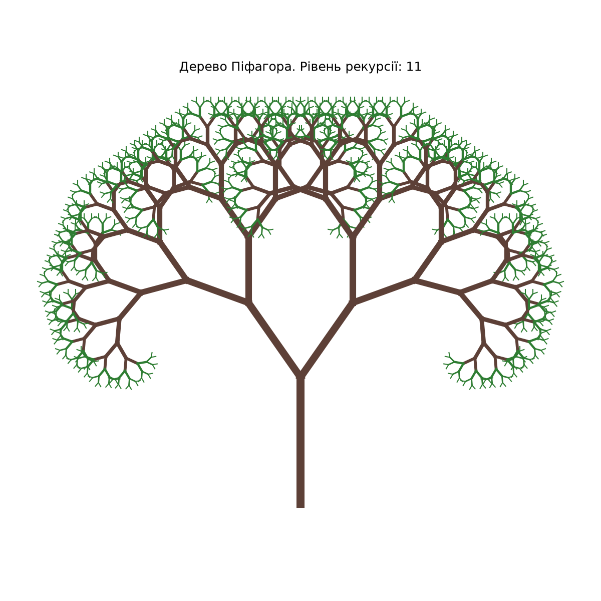
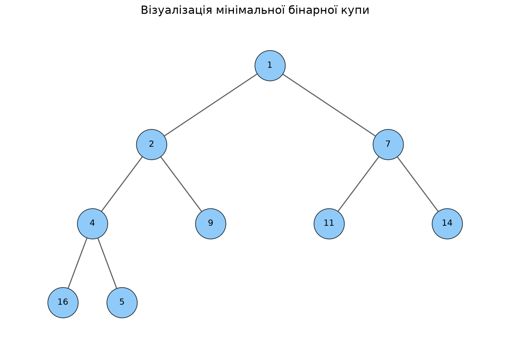
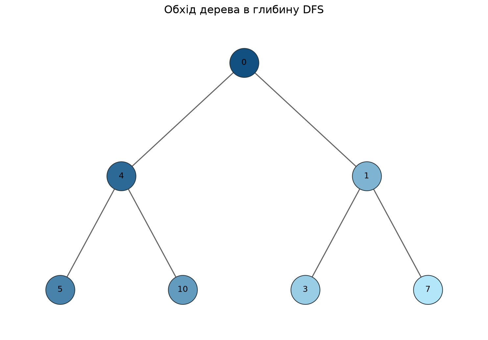
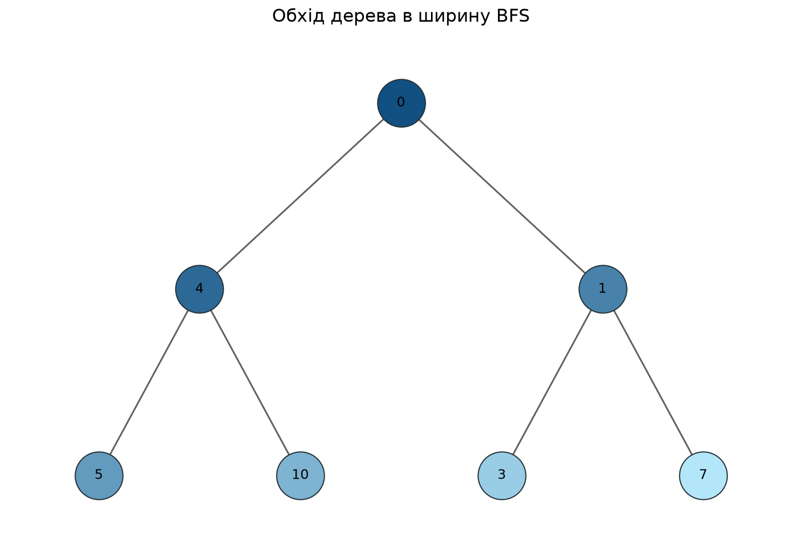
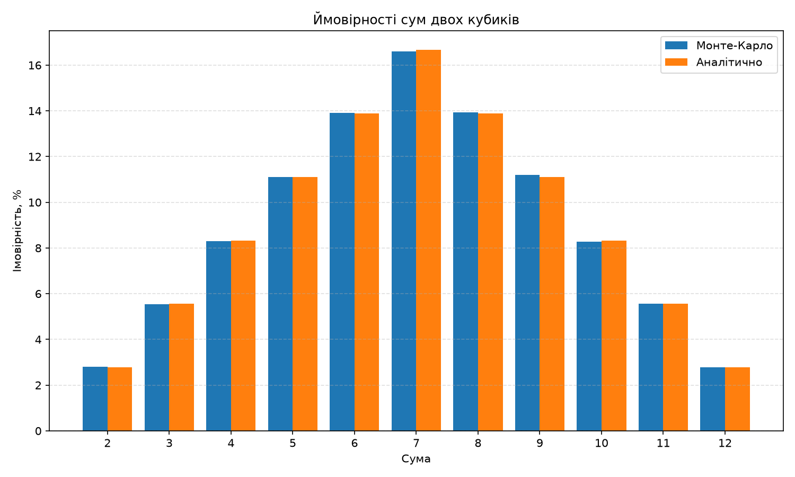

# goit-algo-final-project

Фінальний проєкт курсу «Алгоритми та структури даних».

У роботі реалізовано сім завдань: операції з однозв'язним списком, рекурсивний фрактал, алгоритм Дейкстри, візуалізацію бінарної купи, обходи дерева DFS і BFS, жадібний алгоритм, динамічне програмування та метод Монте-Карло.

## Структура проєкту

```text
goit-algo-final-project/
├── .gitignore
├── README.md
├── task_1.py
├── task_2.py
├── task_3.py
├── task_4.py
├── task_5.py
├── task_6.py
├── task_7.py
├── tree_visualization.py
├── pythagoras_tree.png
├── heap_visualization.png
├── dfs_traversal.png
├── bfs_traversal.png
└── dice_probabilities.png
```

## Встановлення залежностей

Для запуску завдань із візуалізацією потрібна бібліотека `matplotlib`:

```bash
python3 -m pip install matplotlib
```

## Завдання 1. Однозв'язний список

У файлі `task_1.py` реалізовано:

- реверсування однозв'язного списку через зміну посилань між вузлами;
- сортування списку методом злиття;
- об'єднання двох відсортованих списків в один.

Приклад результату:

```text
Початковий список:
18 -> 7 -> 12 -> 3 -> 25 -> 10 -> None

Список після реверсування:
10 -> 25 -> 3 -> 12 -> 7 -> 18 -> None

Відсортований список:
3 -> 7 -> 10 -> 12 -> 18 -> 25 -> None

Об'єднаний відсортований список:
1 -> 3 -> 6 -> 7 -> 10 -> 12 -> 14 -> 18 -> 25 -> 30 -> None
```

Складність сортування злиттям — `O(n log n)`.

## Завдання 2. Дерево Піфагора

У файлі `task_2.py` рекурсивно будується фрактал «дерево Піфагора». Користувач може вказати рівень рекурсії від 1 до 12. Результат зберігається у файл `pythagoras_tree.png`.

Приклад запуску:

```bash
python3 task_2.py
```



## Завдання 3. Алгоритм Дейкстри

У файлі `task_3.py` реалізовано алгоритм Дейкстри для зваженого графа. Для вибору вершини з найменшою поточною відстанню використовується бінарна купа з модуля `heapq`.

Для початкової вершини `A` отримано:

| Вершина | Відстань | Найкоротший шлях |
| --- | ---: | --- |
| A | 0 | A |
| B | 5 | A → C → B |
| C | 2 | A → C |
| D | 6 | A → C → B → D |
| E | 10 | A → C → E |
| F | 12 | A → C → E → F |

Часова складність алгоритму з бінарною купою — `O((V + E) log V)`.

## Завдання 4. Візуалізація бінарної купи

У файлі `task_4.py` список перетворюється на мінімальну бінарну купу за допомогою `heapq.heapify`. Побудова та візуалізація дерева винесені у спільний модуль `tree_visualization.py`.

```text
Початкові значення: [16, 4, 11, 2, 9, 7, 14, 1, 5]
Мінімальна купа: [1, 2, 7, 4, 9, 11, 14, 16, 5]
```



## Завдання 5. Обходи DFS і BFS

У файлі `task_5.py` реалізовано два нерекурсивні алгоритми обходу бінарного дерева:

- DFS — обхід у глибину з використанням стека;
- BFS — обхід у ширину з використанням черги.

Колір вузлів змінюється від темного до світлого відповідно до порядку відвідування.

```text
DFS: [0, 4, 5, 10, 1, 3, 7]
BFS: [0, 4, 1, 5, 10, 3, 7]
```

### DFS



### BFS



## Завдання 6. Жадібний алгоритм і динамічне програмування

У файлі `task_6.py` порівнюються два способи вибору продуктів із максимальною калорійністю в межах бюджету:

- жадібний алгоритм сортує продукти за співвідношенням калорій до вартості;
- динамічне програмування знаходить оптимальну комбінацію.

Для бюджету `1000` отримано:

| Алгоритм | Обрані продукти | Вартість | Калорійність |
| --- | --- | ---: | ---: |
| Жадібний | red-bull, spaghetti, apple, chips, oatmeal, cheddar | 400 | 1420 |
| Динамічне програмування | red-bull, chips, apple, oatmeal, spaghetti, cheddar | 400 | 1420 |

Обидва алгоритми обрали всі доступні продукти та отримали однакову загальну калорійність, оскільки бюджет перевищує їхню сумарну вартість. Відрізняється лише порядок продуктів у результаті.

## Завдання 7. Метод Монте-Карло

У файлі `task_7.py` моделюється `500 000` кидків двох кубиків. Програма підраховує кількість появ кожної суми від 2 до 12, визначає експериментальні ймовірності та порівнює їх з аналітичними значеннями.

| Сума | Монте-Карло | Аналітично |
| ---: | ---: | ---: |
| 2 | 2.80% | 2.78% |
| 3 | 5.55% | 5.56% |
| 4 | 8.30% | 8.33% |
| 5 | 11.10% | 11.11% |
| 6 | 13.90% | 13.89% |
| 7 | 16.60% | 16.67% |
| 8 | 13.93% | 13.89% |
| 9 | 11.19% | 11.11% |
| 10 | 8.29% | 8.33% |
| 11 | 5.56% | 5.56% |
| 12 | 2.78% | 2.78% |



Результати методу Монте-Карло близькі до аналітичних значень. Найчастіше випадає сума 7, оскільки для неї існує найбільше можливих комбінацій двох кубиків.

## Запуск програм

```bash
python3 task_1.py
python3 task_2.py
python3 task_3.py
python3 task_4.py
python3 task_5.py
python3 task_6.py
python3 task_7.py
```

Під час запуску завдань із візуалізацією потрібно закрити відкрите графічне вікно, щоб програма продовжила або завершила роботу.

## Висновок

У проєкті реалізовано та перевірено алгоритми роботи зі списками, графами, деревами й бінарною купою, а також рекурсію, жадібний підхід, динамічне програмування та метод Монте-Карло. Отримані результати відповідають очікуваним: алгоритм Дейкстри знаходить найкоротші шляхи, жадібний алгоритм і динамічне програмування правильно виконують вибір продуктів у межах заданого бюджету, а результати симуляції кубиків наближаються до аналітичних імовірностей.
