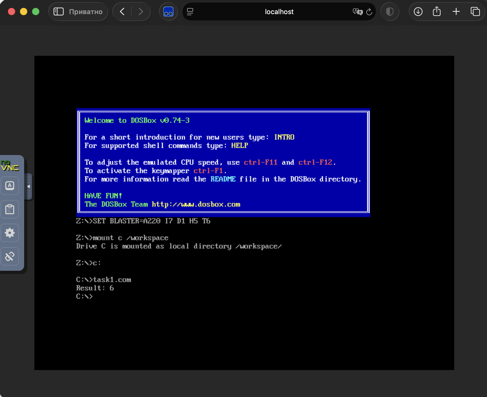

# goit-cs-hw-01

Домашнє завдання до теми 2

Мета роботи — закріпити розуміння основ програмування на низькому та високому рівнях. У першому завданні необхідно навчитися модифікувати програму мовою асемблера, працювати з регістрами процесора та виконувати арифметичні операції. У другому — розширити інтерпретатор і краще зрозуміти принципи лексичного та синтаксичного аналізу, пріоритет арифметичних операцій і обробку виразів у дужках.

У роботі виконано два незалежні завдання:

1. Обчислення арифметичного виразу `b - c + a` мовою асемблера.
2. Розширення інтерпретатора арифметичних виразів мовою Python.

## Структура проєкту

```text
goit-cs-hw-01/
├── .gitignore
├── Dockerfile
├── README.md
├── task1.asm
├── task1.png
└── task2.py
```

## Завдання 1. Обчислення виразу мовою асемблера

У файлі `task1.asm` реалізовано програму мовою асемблера, яка обчислює вираз:

```text
b - c + a
```

Використано такі значення:

```text
a = 5
b = 3
c = 2
```

Результат обчислення:

```text
3 - 2 + 5 = 6
```

Обчислення виконується командами:

```asm
mov al, [b]
sub al, [c]
add al, [a]
```

Після обчислення результат перетворюється на ASCII-символ і виводиться на екран за допомогою DOS-переривання `int 21h`.

### Запуск програми

Для компіляції NASM-програми та запуску DOSBox використовується Docker.

Збірка Docker-образу:

```bash
docker build -t goit-cs-hw-01 .
```

Запуск контейнера:

```bash
docker run --rm -it -p 8080:8080 --name goit-cs-hw-01 goit-cs-hw-01
```

Після запуску вебінтерфейс DOSBox доступний за адресою:

```text
http://localhost:8080/vnc.html
```

Програма автоматично компілюється у файл `task1.com` та запускається в DOSBox.

Отриманий результат:

```text
Result: 6
```

### Результат виконання



## Завдання 2. Інтерпретатор арифметичних виразів

За основу використано початковий код інтерпретатора з [Chapter 02](https://github.com/goitacademy/Computer-Systems-and-Their-Fundamentals/tree/main/Chapter%2002).

Початковий інтерпретатор підтримував тільки додавання та віднімання. У файлі `task2.py` його розширено підтримкою:

* множення `*`;
* ділення `/`;
* круглих дужок `(` і `)`;
* правильного пріоритету арифметичних операцій;
* вкладених виразів у дужках.

### Лексичний аналізатор

До класу `TokenType` додано нові типи токенів:

```text
MUL
DIV
LPAREN
RPAREN
```

Метод `get_next_token` класу `Lexer` розпізнає числа та символи:

```text
+  -  *  /  (  )
```

### Синтаксичний аналізатор

У класі `Parser` реалізовано три рівні обробки виразів:

* `factor` — обробляє числа та вирази в дужках;
* `term` — обробляє множення та ділення;
* `expr` — обробляє додавання та віднімання.

Така структура забезпечує правильний пріоритет операцій:

```text
factor → term → expr
```

Множення та ділення виконуються раніше за додавання і віднімання, а вирази в дужках мають найвищий пріоритет.

### Інтерпретатор

Метод `visit_BinOp` класу `Interpreter` підтримує чотири арифметичні операції:

```text
+
-
*
/
```

Для виконання операцій використано функції `add`, `sub`, `mul` і `truediv` зі стандартного модуля `operator`.

### Запуск інтерпретатора

У терміналі потрібно виконати:

```bash
python3 task2.py
```

Для завершення програми потрібно ввести:

```text
exit
```

### Перевірка роботи

Інтерпретатор перевірено на різних арифметичних виразах:

| Вираз                | Результат |
| -------------------- | --------: |
| `7 + 5 - 3`          |       `9` |
| `2 + 3 * 4`          |      `14` |
| `(2 + 3) * 4`        |      `20` |
| `20 / 5 + 1`         |     `5.0` |
| `(18 - 6) / (2 + 1)` |     `4.0` |
| `2 * (3 + (4 - 1))`  |      `12` |

Приклад із завдання:

```text
Введіть вираз або "exit": (2 + 3) * 4
Результат: 20
```

Результати підтверджують, що інтерпретатор правильно обробляє множення, ділення, пріоритет операцій і вкладені дужки.

## Висновок

У першому завданні створено програму мовою асемблера для обчислення виразу `b - c + a`. Програму скомпільовано за допомогою NASM та успішно запущено в DOSBox.

У другому завданні розширено початковий інтерпретатор арифметичних виразів. Додано підтримку множення, ділення та дужок зі збереженням правильного пріоритету операцій.
