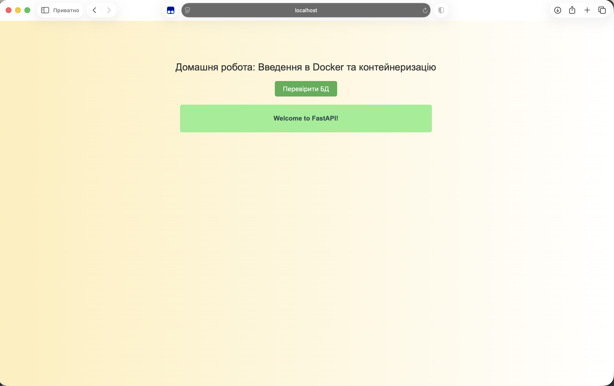

# goit-cs-hw-02

Мета роботи — навчитися створювати Bash-скрипти для автоматичної перевірки вебсайтів, а також контейнеризувати FastAPI-застосунок і налаштовувати його підключення до PostgreSQL за допомогою Docker Compose.

## Завдання 1. Перевірка вебсайтів

Створено Bash-скрипт `task1.sh`, який:

- містить список вебсайтів;
- виконує HTTP GET-запити командою `curl`;
- опрацьовує переадресації;
- перевіряє HTTP статус-код;
- записує результати у файл `website_status.log`.

### Запуск

```bash
cd Src
chmod +x task1.sh
./task1.sh
cat website_status.log
```

## Завдання 2. FastAPI та PostgreSQL

Клоновано FastAPI-застосунок та створено:

- `Dockerfile` для побудови Docker-образу;
- `docker-compose.yaml` для запуску застосунку та PostgreSQL;
- підключення до бази даних через назву сервісу `postgres`.

### Запуск

```bash
cd Src/task2
docker compose up --build -d
```

Перевірка контейнерів:

```bash
docker compose ps
```

Перевірка підключення до бази даних:

```bash
curl http://localhost:8000/healthchecker
```

Зупинення контейнерів:

```bash
docker compose down
```

## Результат

FastAPI-застосунок успішно запущено в Docker. Підключення до PostgreSQL працює правильно.

