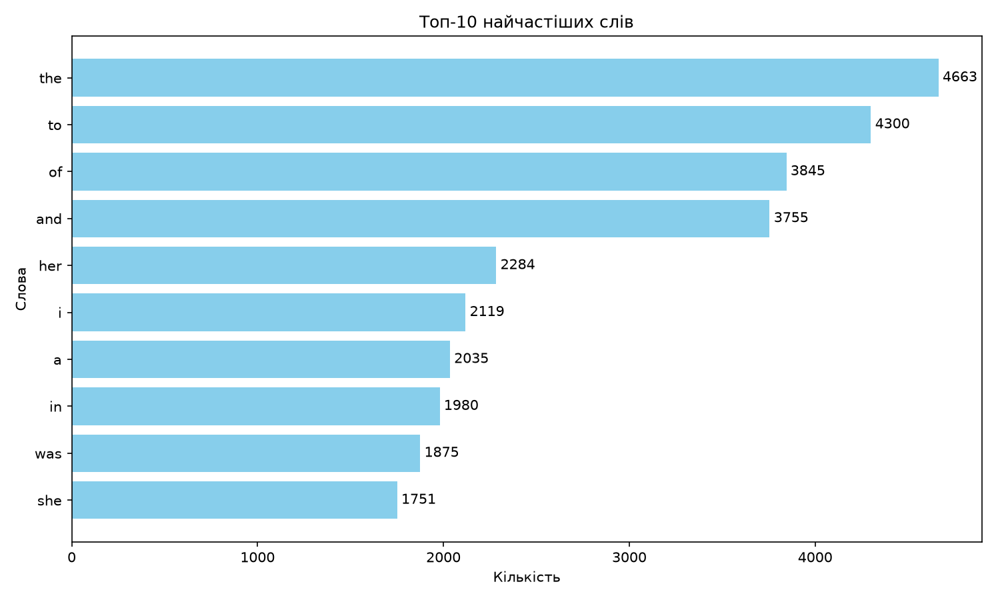

# Домашнє завдання `goit-cs-hw-05`

Домашня робота до модуля **«Асинхронне програмування»**.

Проєкт містить два завдання:

1. асинхронне сортування файлів за розширеннями;
2. аналіз частоти слів за допомогою парадигми MapReduce та побудова графіка.

## Структура проєкту

```text
goit-cs-hw-05/
├── task1.py
├── task2.py
├── requirements.txt
├── top_words.png
├── .gitignore
└── README.md
```

## Встановлення

Для запуску потрібен Python 3.10 або новіший.

Створення та активація віртуального середовища на macOS або Linux:

```bash
python3 -m venv .venv
source .venv/bin/activate
```

На Windows:

```powershell
python -m venv .venv
.\.venv\Scripts\Activate.ps1
```

Встановлення залежностей:

```bash
python -m pip install -r requirements.txt
```

## Завдання 1. Асинхронне сортування файлів

Скрипт `task1.py` рекурсивно знаходить файли у вихідній папці та копіює
їх до папки призначення, розподіляючи за розширеннями.

Основні можливості:

- асинхронне виконання файлових операцій через `asyncio`;
- обмеження кількості одночасних операцій за допомогою семафора;
- створення окремої папки для кожного розширення;
- збереження файлів без розширення в папці `no_extension`;
- захист від перезапису файлів з однаковими назвами;
- журналювання результатів та помилок.

Запуск:

```bash
python task1.py <source> <output>
```

Приклад:

```bash
python task1.py ./source_folder ./output --concurrency 10
```

Параметр `--concurrency` визначає максимальну кількість одночасних
операцій копіювання. Значення за замовчуванням — `10`.

Приклад структури результату:

```text
output/
├── jpg/
│   └── photo.jpg
├── txt/
│   ├── report.txt
│   └── report_1.txt
└── no_extension/
    └── README
```

## Завдання 2. MapReduce-аналіз частоти слів

Скрипт `task2.py` завантажує текст за URL-адресою, розбиває його на
частини, паралельно підраховує слова через `ThreadPoolExecutor`, об'єднує
результати та зберігає діаграму найчастіших слів.

Якщо URL не вказано, використовується текст роману **«Pride and Prejudice»**
із сайту Project Gutenberg.

Запуск зі стандартними параметрами:

```bash
python task2.py
```

Запуск із власними параметрами:

```bash
python task2.py <URL> --top 10 --workers 4 --timeout 30 --output top_words.png
```

Параметри:

| Параметр | Опис | Типове значення |
|---|---|---:|
| `URL` | Адреса текстового файлу | Project Gutenberg |
| `--top` | Кількість слів на графіку | `10` |
| `--workers` | Кількість потоків | `4` |
| `--timeout` | Тайм-аут HTTP-запиту в секундах | `30` |
| `--output` | Назва вихідного PNG-файлу | `top_words.png` |

Приклад отриманого результату:

| Слово | Кількість |
|---|---:|
| the | 4663 |
| to | 4300 |
| of | 3845 |
| and | 3755 |
| her | 2284 |
| i | 2119 |
| a | 2035 |
| in | 1980 |
| was | 1875 |
| she | 1751 |

## Візуалізація



## Перевірка

Перевірка синтаксису та довідки командного рядка:

```bash
python -m py_compile task1.py task2.py
python task1.py --help
python task2.py --help
```

Програми перевірено на вкладених папках, дубльованих назвах файлів,
файлах без розширень, Unicode-тексті, порожньому тексті та різній кількості
потоків.
